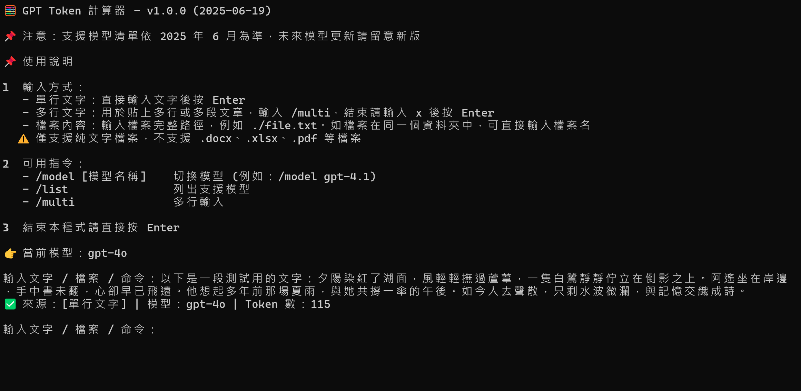

# 🧮 GPT Token Counter

一個簡單好用的 GPT Token 計算器，支援多種 OpenAI 模型。  
可輸入文字、純文字檔案路徑，或進入多行輸入模式計算 token 數。

---

## ✅ 功能特色

- 支援多個 GPT / OpenAI 模型
- 支援單行、貼上多行或讀取 `.txt` 等純文字檔案
- 可切換模型與查看支援列表
- 無須連線、設定簡單
- 完全隱私，在自己電腦裡運作，不怕在網路上曝光敏感資訊

---

🖼️ 工具執行畫面截圖：



---

## 🚀 安裝與執行方式（適用 Windows 使用者）

### 1. 安裝 Python

前往 [Python 官方網站](https://www.python.org/downloads/) 下載最新版本，例如 3.xx。  

**⚠️ 安裝時請勾選：** ✅ `Add Python 3.xx to PATH`

### 2. 安裝 pip 套件

開啟命令提示字元（CMD），輸入以下指令，在 Python 內安裝 `tiktoken` 套件：

```bash
pip install tiktoken
```

如果出現錯誤，請改用：

```bash
python -m pip install tiktoken
```

#### 什麼是 tiktoken？

`tiktoken` 是 OpenAI 官方開發的開源套件，功能是將文字轉換為 token 並計算 token 數量。

---

## ▶️ 執行方式

你可以用以下兩種方式執行 `gpt_token_counter.py`：

### 方法一（最簡單）：
直接**滑鼠左鍵點兩下執行 `gpt_token_counter.py`**  
（前提是已正確安裝 Python 並關聯 `.py` 檔案）

### 方法二：使用命令列
1. 在含有 `gpt_token_counter.py` 的資料夾中按住 Shift + 滑鼠右鍵 → 選「在終端中開啟 / 在這裡開啟 PowerShell 視窗」
2. 輸入以下指令執行：

```bash
python gpt_token_counter.py
```

---

## 📁 使用說明

```
🦮 GPT Token 計算器 - v1.0.0 (2025-06-19)

📌 使用說明：
1️⃣ 輸入方式：
   - 單行文字：直接輸入文字後按 Enter
   - 多行文字：輸入 /multi，結束請輸入 x 後按 Enter
   - 檔案內容：輸入檔案完整路徑，例如 ./example.txt
     ⚠️ 僅支援純文字檔案，請勿使用 .docx、.xlsx、.pdf 等格式

2️⃣ 可用指令：
   - /model [模型名稱]    切換模型
   - /list                列出支援模型
   - /multi               多行輸入（結束請輸入 x）

3️⃣ 結束請直接按 Enter
```

---

## 📅 版本資訊

- 本程式版本：**v1.0.0 (建立日期：2025-06-19)**
- 支援模型列表根據 OpenAI 當前版本
- 模型名稱未來可能會隨時間而新增/更動

---

## 🚫 常見錯誤 FAQ

### ❌ pip 指令不能用？
請改用：

```bash
python -m pip install tiktoken
```

### ❌ 無法執行 python 指令？
可能是因為沒有勾選「Add Python to PATH」，請再次安裝 Python 並勾選此項

---

## 📬 聯絡作者

如果有任何問題或改進建議，歡迎開 issue 或直接聯絡我：

- GitHub：[@JoshuaWang2211](https://github.com/JoshuaWang2211)  

---

本專案由作者 Joshua Wang 採取 vibe-coding 方式一邊學習、一邊實作。

開發初衷是因想要避免 API token 用量不小心暴衝，又不想將敏感內容貼到線上工具，便萌生了打造專屬 token 計算器的想法，並著手實現。

開發節奏自由，功能也會依照實際需求或新想法不定期更新。歡迎對 AI 實作有興趣的朋友一同參考、延伸，或交流改進。
